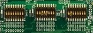

Let's boot
==========

Make sure that @board@ boot mode jumpers are set like in the following picture:

Insert the SD card you just prepared inside socket **SD4**.

Connect the mini-USB cable from your PC to @board@ USB OTG connector .

And now proceed by setting up the serial console.

.. include:: serial_console.rst

Give *root* to the login prompt:

.. board::

 | @machine-name@ login: root

and press *Enter*.

.. note::

 Sometimes, the time you spend setting up minicom makes you miss all the output that leads to the login and you see just a black screen, press *Enter* then to get the login prompt.

For more information on flashing, see Section "Booting from an SD card" in the i.MX Linux® User's Guide
